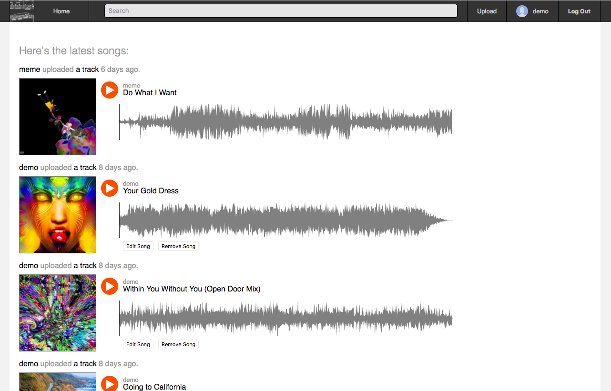
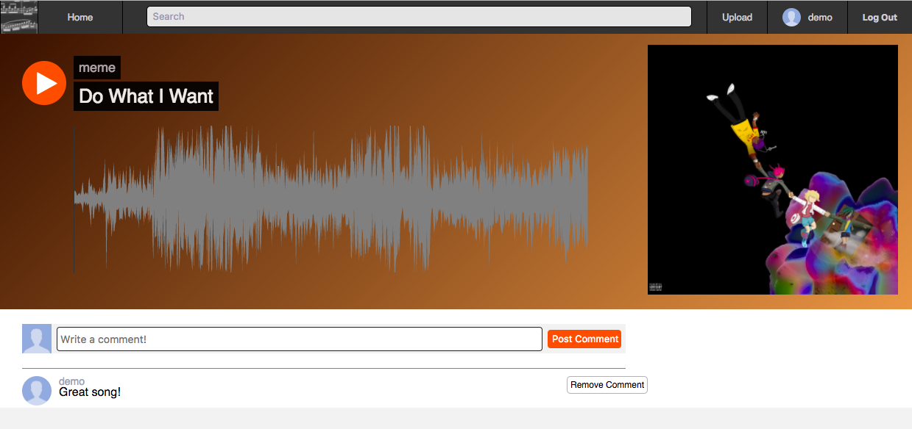

# SonataCloud

[Live][heroku]

[heroku]: https://sonatacloud.us/#/

## Features & Implementation

### Song Indexing

On the backend, songs are stored in a single table on the database with columns for `id`, `artist_id`, `title`, `created_at`, `data`, and `cover_art`. When the feed is initially rendered, an API call is made to the songs table, gathering the 10 most recently uploaded songs. When scrolling down, there is a load more that will load the next 10 most recently uploaded songs. These songs are held in a segment of state and are cleared out whenever a new feed is loaded or song page is displayed.

Songs are rendered on the index as well as on the song show page. On the song show page, an additional API call is made the fetch the comments on the song and render them beneath the song display. The UI strives to emulate that of SoundCloud as much as possible.

### Current Song Player

The current song player operates through a separate segment of state. When a user clicks a play button, an action is sent to set the song assigned to the play button as the current song. After this point, navigating between pages will not change the current song unless a new song is played. As a result, music will play continuously as a user navigates between pages.

### Play Button

When a play button is pressed on a song, an action is sent to replace the current song with the song on which the play button is pressed. Once the current song is replaced, it will play immediately and the play button will now act as a play and pause switch for the audio player. This is done through comparisons between segments of state for the current song and the song to which the play button refers.

This results in creating an intuitive, easy to use interface in which every play button behaves like it should.

### User Pages

Users are stored in the database with an association to the songs they have uploaded. Upon rendering a user page, a fetch is made to fetch all of the songs the user created and these songs replace the ones in the store, allowing the same feed component to be used on both the main feed page and the user pages.
